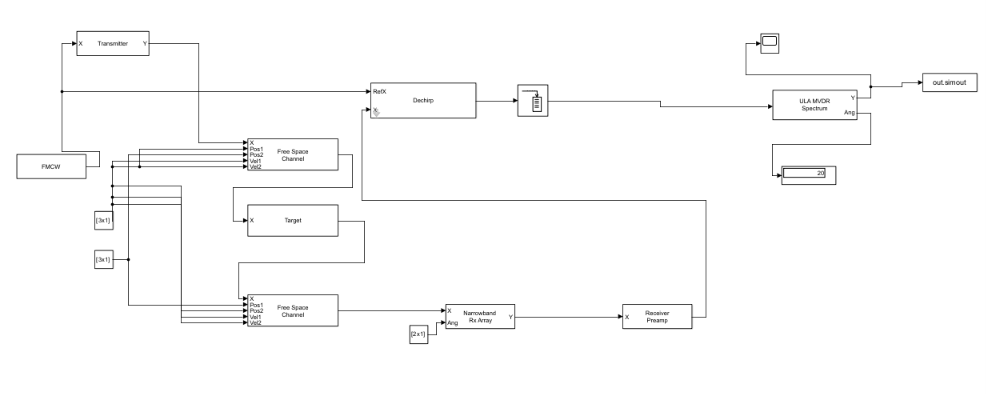
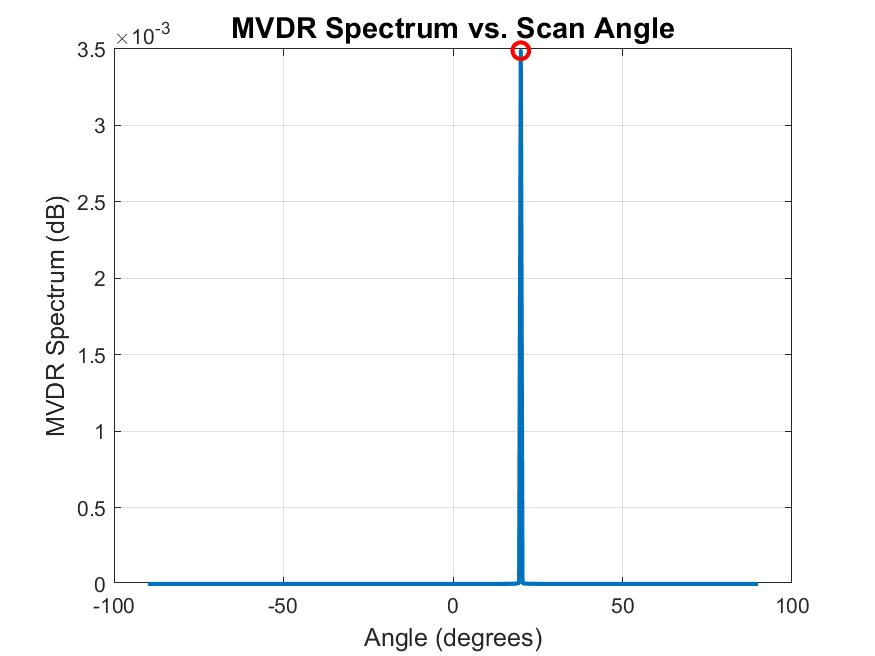

# Day 4: Angle of Arrival Estimation (MVDR Beamforming)

A **Uniform Linear Array (ULA)** and **MVDR (Minimum Variance Distortionless Response) Beamformer** were used to estimate a target's arrival angle in Simulink, adding a third radar measurement (bearing) alongside the range (Day 1) and velocity (Day 2) established in previous projects.

---

## Why Angle Estimation Needs Multiple Antennas

A single antenna can measure range and velocity but has no spatial resolution — it cannot distinguish whether a target is ahead or off to one side. A ULA solves this by spreading multiple elements across space: a signal arriving at angle $\theta$ travels a slightly different distance to each element, producing a linear phase ramp across the array whose slope directly encodes the arrival angle.

**MVDR beamforming** estimates this adaptively. It minimises total output power from all other directions while maintaining a gain of 1 in the steering direction, by inverting the spatial covariance matrix $\mathbf{R}_x$:

$$P_{\text{MVDR}}(\theta) = \frac{1}{\mathbf{a}(\theta)^H \mathbf{R}_x^{-1} \mathbf{a}(\theta)}$$

---

## Parameters

| Parameter | Value |
| :--- | :--- |
| Carrier frequency $f_c$ | $77 \text{ GHz}$ |
| Wavelength $\lambda$ | $3.896 \text{ mm}$ |
| Number of array elements | $8$ |
| Element spacing $d$ | $\lambda/2 = 1.9481 \text{ mm}$ |
| Element type | Isotropic |
| Target range | $50 \text{ m}$ |
| Target azimuth (true) | $20^\circ$ |
| Scan angle grid | $-90^\circ$ to $90^\circ$, $0.5^\circ$ steps |
| Receiver Preamp | Gain $0 \text{ dB}$, NF $3 \text{ dB}$, Ref. temp $290 \text{ K}$ |
| Transmitter | Peak power $1 \text{ W}$, Gain $120 \text{ dB}$ |
| Expected $3\text{ dB}$ beamwidth | $\approx 15.4^\circ$ |

---

## Architecture

The round-trip propagation is split into two one-way legs with the Target and Narrowband Rx Array inserted between them:

```
FMCW → Transmitter → Free Space Channel 1 → Target → Free Space Channel 2
                                                              ↓
                                               Narrowband Rx Array (8 elements)
                                                              ↓
                                                     Receiver Preamp
                                                              ↓
FMCW ──────────────────────────────────→ Dechirp (Ref, X) ←──┘
                                               ↓
                                            Buffer
                                               ↓
                                    ULA MVDR Spectrum (Y, Ang)
                                        ↓            ↓
                                   To Workspace   Display
```



---

## Results

| Metric | Expected | Measured |
| :--- | :--- | :--- |
| Target azimuth | $20.0^\circ$ | $20.0^\circ$ |
| Consistency across runs | Stable | Confirmed stable |

The MVDR spectrum was extracted from `out.simout` and plotted in MATLAB, showing a clean peak at exactly $20^\circ$:



---

## Analysis Script

```matlab
scanAngles = -90:0.5:90;
Y = out.simout.Data(:,1,2);   % page 2 holds the real spectrum

plot(scanAngles, Y);
xlabel('Angle (degrees)');
ylabel('MVDR Spectrum (dB)');
grid on;

[peakVal, peakIdx] = max(Y);
fprintf('Peak found at %.1f degrees, value = %.2f\n', scanAngles(peakIdx), peakVal);
```

---

## Future Improvements

- Use separate named `To Workspace` blocks per output to avoid multi-page `NaN` entries in `out.simout`.
- Document the sign convention difference between `Narrowband Rx Array` and `ULA MVDR Spectrum` with a reference table.
- Compare MVDR against a conventional Beamscan estimator to quantify the angular resolution improvement.

---

## Files

- [fmcw_range_model.slx](scripts/fmcw_range_model.slx) — Simulink model for Angle of Arrival estimation
- [aoa_analysis.m](scripts/aoa_analysis.m) — MATLAB script to extract and plot the MVDR spectrum
