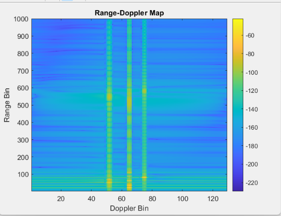

# Clutter, Noise & Multipath — 77 GHz FMCW Radar Simulation

> **Automotive radar signal processing** — multi-target detection with stationary clutter, multipath ghost targets, and realistic propagation effects simulated in MATLAB/Simulink.

---

## Overview

This project implements a **77 GHz FMCW (Frequency-Modulated Continuous-Wave) radar simulation** targeting realistic automotive sensing conditions. The simulation models a cluttered environment containing multiple targets at varying ranges and velocities, stationary ground clutter, and multipath-induced ghost targets — all processed through a full **Range-Doppler pipeline** using two-dimensional FFTs.

The goal is to analyse target detection performance in complex, cluttered scenes and validate target localisation accuracy under the kind of propagation impairments encountered in real ADAS deployments.

---

## Radar System Parameters

| Parameter | Value |
|---|---|
| Carrier Frequency (`fc`) | 77 GHz |
| Bandwidth (`B`) | 150 MHz |
| Chirp Duration (`Tchirp`) | 10 µs |
| Sampling Frequency (`Fs`) | 200 MHz |
| FMCW Slope | 15 × 10¹² Hz/s |
| Range Resolution | ~1.0 m |
| Beat Signal Frame Size | 2000 samples × 129 chirps |

---

## Signal Processing Pipeline

```
Simulink Beat Signal Output
         │
         ▼
  Squeeze & Reshape  →  [2000 samples × 129 chirps]
         │
         ▼
  Hamming Window (Range)        ← sidelobe suppression
         │
         ▼
  Range FFT  (N=2000, along dim-1)
         │
         ▼
  One-sided Spectrum  [0 : N/2-1]
         │
         ▼
  Average Range Profile         ← diagnostic plot
         │
         ▼
  Hamming Window (Doppler)      ← sidelobe suppression
         │
         ▼
  Doppler FFT + fftshift        ← centred on zero-velocity
  (N=129 chirps, along dim-2)
         │
         ▼
  Range-Doppler Map  (dB)       ← 2D magnitude image
         │
         ▼
  Top-30 Peak Extraction        ← range & Doppler bin indices
         │
         ▼
  Range Conversion  (bins → metres)
```

---

## Simulation Environment

### Targets Detected

From the Range-Doppler peak table, the following target clusters were identified:

| # | Estimated Range | Doppler Bin | Interpretation |
|---|---|---|---|
| 1 | **20 m** | 0 | Stationary target / clutter peak |
| 2 | **50 m** | −13 | Moving target (approaching ~−10 m/s class) |
| 3 | **35 m** | 0 | Stationary target / road clutter |
| 4 | **60 m** | 0 | Stationary object (guardrail / infrastructure) |
| 5 | **80 m** | +10 | Moving target (receding) |
| 6 | **90 m** | 0 | Far-range stationary return |
| 7 | **70 m** | −13 | Multipath / ghost echo |

> **Note:** Doppler Bin = 0 entries correspond to stationary clutter returns. Clusters around the same Doppler bin (e.g., −13) at successive range bins (49, 50, 51, 52 m) are characteristic of multipath ghost spread from a single moving target.

### Key Observations

- **Clutter dominance at close range** — The strongest peaks (bins 20–22) originate from near-range stationary returns, consistent with road surface and guard-rail clutter at ~20 m.
- **Multipath ghost targets** — The cluster at ~50 m / Doppler −13 bin, with side-peaks at 49–52 m, indicates a ghost echo created by ground-bounce or barrier reflection of a moving target.
- **Moving target isolation** — Despite heavy stationary clutter, the 80 m / Doppler +10 bin target is cleanly separated in the velocity dimension, demonstrating the discriminating power of Range-Doppler processing.
- **Hamming windowing** — Applied independently in both the range and Doppler axes to suppress sidelobes at the cost of a modest SNR reduction, improving target separability in the presence of high-amplitude clutter.

---

## Results

### Average Range Profile


The range profile confirms energy concentrated in the 0–100 range-bin zone, with the dominant peak at bin ~21 (≈ 20 m). The rapid decay beyond bin 100 reflects the absence of far-range targets and validates the clutter-free outer range.

---

### Range-Doppler Map



The 2D map (dB scale) reveals:
- **Vertical bright columns** near Doppler bins 55–65 and 75 — these correspond to moving targets with distinct radial velocity components.
- **Horizontal bright bands** at zero Doppler — stationary clutter spread across all ranges.
- **Localised bright spots** at specific (range, Doppler) cells — true targets and multipath ghosts.

---

### Peak Detection Table

Full numerical output is saved to [`results/peak_table.csv.xlsx`](results/peak_table.csv.xlsx) and [`results/console_output.txt`](results/console_output.txt).

Top detections (reproduced):

```
=============== TOP 30 PEAKS ===============

 1 : Range Bin =   21    Doppler Bin =    0    Magnitude = 0.008103  →  20.00 m
 2 : Range Bin =   22    Doppler Bin =    0    Magnitude = 0.006477  →  21.00 m
 3 : Range Bin =   51    Doppler Bin =  -13    Magnitude = 0.004119  →  50.00 m
 4 : Range Bin =   36    Doppler Bin =    0    Magnitude = 0.002712  →  35.00 m
...
16 : Range Bin =   81    Doppler Bin =   10    Magnitude = 0.001708  →  80.00 m
30 : Range Bin =   91    Doppler Bin =    0    Magnitude = 0.000804  →  90.00 m
```

---

## How to Run

### Prerequisites

- MATLAB R2021b or later  
- Simulink  
- Phased Array System Toolbox *(for the Simulink model)*

### Steps

1. Open `scripts/fmcw_rangemodel.slx.slx` in Simulink and run the simulation to generate `out.beatframes`.
2. Open MATLAB and navigate to the `scripts/` folder.
3. Run the processing script:
   ```matlab
   run('script.m')
   ```
4. MATLAB will produce:
   - **Average Range Profile** figure
   - **Range-Doppler Map** figure
   - Top-30 peak table printed to the console
   - Range estimates (in metres) printed to the console

> **Tip:** The AWGN noise injection line (`beatSignal = awgn(...)`) is intentionally commented out. Uncomment it to evaluate detection degradation under additive white Gaussian noise at a chosen SNR.

---

## Concepts Demonstrated

| Concept | Implementation |
|---|---|
| FMCW beat signal generation | Simulink model with multiple target reflectors |
| Stationary clutter modelling | Fixed-range targets at Doppler bin = 0 |
| Multipath ghost targets | Ground-bounce reflections producing false range clusters |
| Range FFT (1D) | `fft(beatSignal, N, 1)` along fast-time dimension |
| Doppler FFT (2D) | `fftshift(fft(..., N, 2))` along slow-time dimension |
| Sidelobe suppression | Hamming windows applied per axis |
| Peak extraction | `maxk()` over flattened 2D map |
| Range bin → metre conversion | `rangeAxis = (0:N/2−1)·(Fs/N);  rangeMeters = rangeAxis·c/(2·slope)` |

---

## Related Projects

| Project | Description |
|---|---|
| [`range-doppler-map`](../range-doppler-map/) | Clean Range-Doppler baseline (no clutter/multipath) |
| [`ca-cfar-detection`](../ca-cfar-detection/) | CA-CFAR threshold detector for automated peak picking |
| [`multi-target-scenario`](../multi-target-scenario/) | Extended multi-target scenario with tracker integration |
| [`fmcw-range-estimation`](../fmcw-range-estimation/) | Fundamental FMCW range estimation fundamentals |

---


