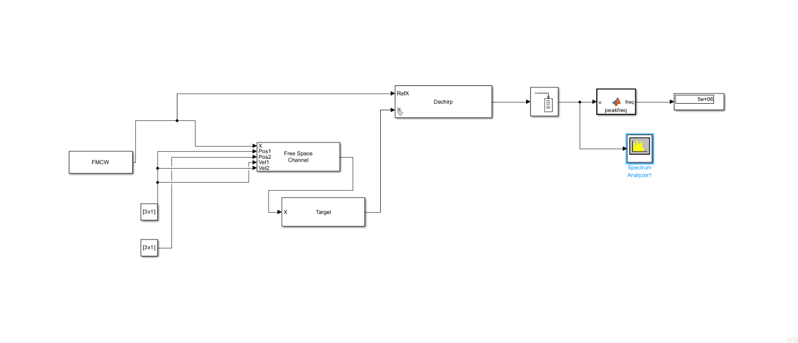
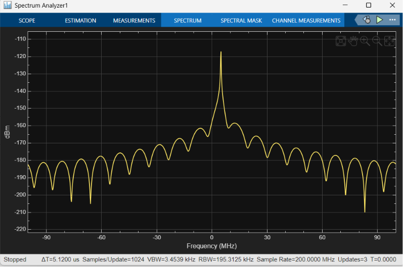

# Day 1: 77 GHz FMCW Radar Range Estimation

This project implements a **77 GHz FMCW (Frequency-Modulated Continuous-Wave) Radar Range Simulator** in Simulink. The model estimates the distance to a static target by computing the **beat frequency** (dechirped signal frequency) resulting from the round-trip time delay of the radar signal.

---

## System Architecture

The simulator is built using Simulink blocks from the DSP System Toolbox and Phased Array System Toolbox. It models the signal generation, free space propagation, target reflection, dechirping, buffering, and spectral analysis.

### Block Diagram
Below is the layout of the Simulink model:



---

## Configuration & Parameters

The simulation parameters are configured as follows:

### 1. Model (Solver) Settings
| Parameter | Value | Details |
| :--- | :--- | :--- |
| **Solver type** | Fixed-step | Ensures deterministic execution in time-domain solver |
| **Solver** | discrete (no continuous states) | No continuous states are modeled |
| **Fixed-step size** | `5e-9` (5 ns) | Matches the sampling period $1 / F_s$ |
| **Stop time** | `10e-6` (10 $\mu$s) | Simulation duration matching one full sweep time |

### 2. FMCW Waveform Block
| Parameter | Value | Details |
| :--- | :--- | :--- |
| **Sweep bandwidth** | $150 \text{ MHz}$ (`150e6`) | Defines range resolution |
| **Sweep time** | $10\ \mu\text{s}$ (`10e-6`) | Duration of a single sweep ramp |
| **Sample rate** | $200 \text{ MHz}$ (`200e6`) | $F_s$ of the digital system |
| **Sweep direction** | Up | Linear ramp increasing in frequency |
| **Output format** | Samples | Outputs individual samples in time-domain |

### 3. Constant Blocks
| Block | Variable | Value | Description |
| :--- | :--- | :--- | :--- |
| **Radar position** | `Pos1` | `[0;0;0]` | Placed at the origin |
| **Target position** | `Pos2` | `[50;0;0]` | Positioned at 50 meters along the X-axis |
| **Radar velocity** | `Vel1` | `[0;0;0]` | Stationary |
| **Target velocity** | `Vel2` | `[0;0;0]` | Stationary (no Doppler offset) |

### 4. Free Space Propagation Block
| Parameter | Value | Details |
| :--- | :--- | :--- |
| **Propagation speed** | $3 \times 10^8 \text{ m/s}$ (`3e8`) | Speed of light $c$ |
| **Signal carrier frequency** | $77 \text{ GHz}$ (`77e9`) | Radar operating frequency |
| **Perform two-way propagation** | Enabled | Models transmitter-to-target and target-to-receiver paths |
| **Inherit sample rate** | Enabled | Inherits the $200\text{ MHz}$ waveform sample rate |
| **Maximum propagation distance** | $500 \text{ m}$ | Maximum expected one-way distance |
| **Simulation method** | Interpreted execution | - |

### 5. Target Block
| Parameter | Value | Details |
| :--- | :--- | :--- |
| **Mean RCS** | $10\text{ m}^2$ | Radar Cross Section (target size) |
| **Operating frequency** | $77 \text{ GHz}$ (`77e9`) | Matches carrier frequency |

### 6. Dechirp Block
* **Settings**: Defaults.
* **Connections**:
  * `Ref` (Reference port) $\leftarrow$ Transmitted FMCW Waveform Output
  * `X` (Signal port) $\leftarrow$ Echo Signal from Target (via Free Space)

### 7. Buffer Block
* **Buffer size**: `2000` samples
* **Buffer overlap**: `0` samples
* **Purpose**: Collects time-domain samples into a discrete frame for FFT analysis.

### 8. Spectrum Analyzer (DSP System Toolbox)
Because the Spectrum Analyzer is connected downstream of the Buffer, it automatically inherits the following properties:
* **Sample rate**: $200 \text{ MHz}$
* **Frame length**: $2000$ samples
* **Sample time**: $5 \text{ ns}$ (`5e-9`)
* **Number of input ports**: `1` (resolves the 1-by-2 vs 1-by-2001 input dimension error)

---

## MATLAB Function Block: Peak Frequency Estimation

To verify the range calculation programmatically, a **MATLAB Function** block is inserted between the Buffer and a Display block. It contains the following peak-frequency extraction code:

```matlab
function freq = peakfreq(u)
    Fs = 200e6;
    N = length(u);
    X = abs(fft(u));
    [~, idx] = max(X(1:floor(N/2)));
    freq = (idx-1) * (Fs/N);
end
```

### Explanation of Code Logic:
1. **`Fs = 200e6`**: Sets the sampling rate of $200 \text{ MHz}$.
2. **`N = length(u)`**: Retrieves the length of the buffered frame ($N = 2000$).
3. **`X = abs(fft(u))`**: Computes the Fast Fourier Transform (FFT) of the dechirped signal to transition from the time domain to the frequency domain.
4. **`[~, idx] = max(X(1:floor(N/2)))`**: Identifies the index of the strongest spectral peak in the positive half of the spectrum.
5. **`freq = (idx-1) * (Fs/N)`**: Converts the 1-based index of the peak bin into a frequency in Hz using the frequency resolution step $\Delta f = F_s/N$.

---

## Theory & Mathematical Calculations

### 1. Round-Trip Time Delay ($\tau$)
For a target at range $R = 50 \text{ m}$ propagating at speed $c = 3 \times 10^8 \text{ m/s}$:
$$\tau = \frac{2 R}{c} = \frac{2 \times 50}{3 \times 10^8} \approx 333.33 \text{ ns}$$

### 2. Frequency Sweep Slope ($S$)
The rate at which the FMCW signal changes frequency is defined by the sweep bandwidth $B$ and the sweep time $T_s$:
$$S = \frac{B}{T_s} = \frac{150 \times 10^6 \text{ Hz}}{10 \times 10^{-6} \text{ s}} = 1.5 \times 10^{13} \text{ Hz/s}$$

### 3. Expected Beat Frequency ($f_b$)
The dechirped beat frequency is the product of the sweep slope and the time delay:
$$f_b = S \cdot \tau = 1.5 \times 10^{13} \text{ Hz/s} \times 3.3333 \times 10^{-7} \text{ s} = 5.0 \text{ MHz}$$

### 4. FFT Resolution ($\Delta f$)
With a buffer size $N = 2000$ and $F_s = 200 \text{ MHz}$:
$$\Delta f = \frac{F_s}{N} = \frac{200 \times 10^6}{2000} = 100 \text{ kHz}$$
Each index step in the discrete Fourier spectrum represents $100 \text{ kHz}$.

For $f_b = 5 \text{ MHz}$, the peak index `idx` in MATLAB (1-based index) is:
$$\text{idx} = \frac{f_b}{\Delta f} + 1 = \frac{5,000,000}{100,000} + 1 = 51$$

---

## Verification & Results

When the simulation runs, the Spectrum Analyzer displays a single sharp peak at **$5\text{ MHz}$**, representing the target at $50\text{ m}$.

* **Target Range**: $50\text{ m}$
* **Observed Spectrum Peak**: $\approx 5\text{ MHz}$
* **MATLAB Function Output**: $5.0 \times 10^6\text{ Hz}$

### Range Estimation Plot
Below is the output generated by the simulation showing the power spectrum of the dechirped signal:


