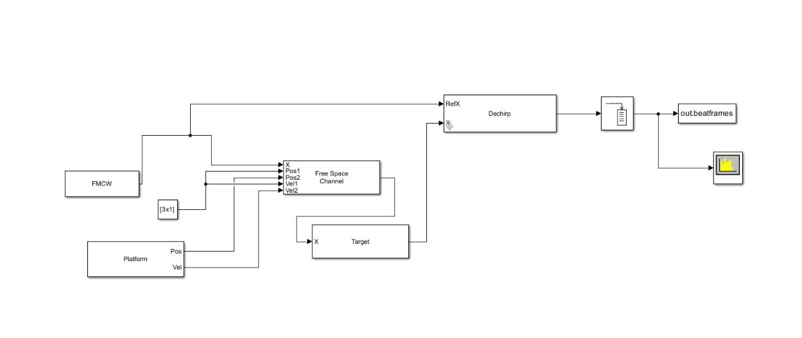
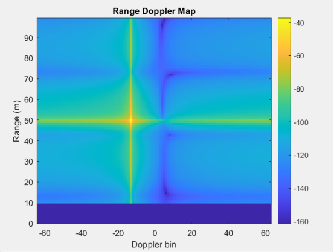
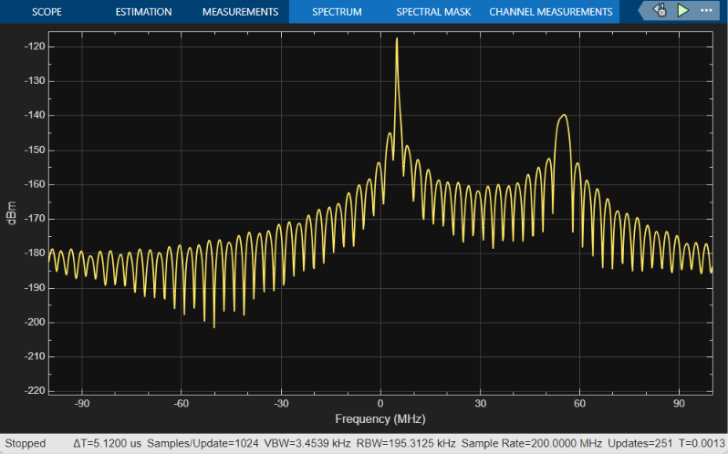

# Day 2: FMCW Range-Doppler Radar Simulation & Processing

A 77 GHz FMCW automotive radar was simulated in Simulink using a 150 MHz bandwidth chirp and 128-chirp Range-Doppler processing, successfully detecting a target at 50 m moving toward the radar at approximately 20 m/s.

---

## Simulink Model & Architecture

The radar system is modeled in Simulink to simulate the round-trip signal propagation and extract the raw beat frequency data (dechirped signal). 

### Simulink Block Diagram
Below is the Simulink block diagram layout:



### Model Components & Workflow
* **FMCW Waveform**: Generates the linear frequency-modulated chirp signal.
* **Free Space Channel**: Simulates propagation delay and two-way path loss for the radar signal.
* **Target**: Models reflection and Radar Cross Section (RCS) of a car-sized target.
* **Dechirp**: Mixes the transmitted (Tx) and received (Rx) signals to produce the beat frequency.
* **Buffer**: Groups the continuous stream into blocks of 2000 samples per chirp.
* **To Workspace**: Exports the raw beat signal matrix (variable `beatFrames`) to the MATLAB workspace.

---

## Simulation Configuration & Parameters

### 1. FMCW Waveform Settings
| Parameter | Value | Details |
| :--- | :--- | :--- |
| **Carrier frequency ($f_c$)** | $77 \text{ GHz}$ | Standard automotive radar band |
| **Bandwidth ($B$)** | $150 \text{ MHz}$ | Determines range resolution |
| **Chirp duration ($T$)** | $10\ \mu\text{s}$ | Duration of a single frequency sweep |
| **Sample rate ($F_s$)** | $200 \text{ MHz}$ | ADC sampling rate |
| **Samples per chirp ($N$)** | $2000$ | $N = F_s \times T$ |
| **Chirp slope ($S$)** | $15 \times 10^{12} \text{ Hz/s}$ | $S = B/T$ |

### 2. Target & Ego Settings
| Category | Parameter | Value | Details |
| :--- | :--- | :--- | :--- |
| **Target** | Initial Position | `[50; 0; 0]` m | Placed 50 meters away along the X-axis |
| **Target** | Initial Velocity | `[-20; 0; 0]` m/s | Moving toward the radar at $20\text{ m/s}$ |
| **Target** | Radar Cross Section (RCS) | Car-sized target | Modeled using the Target block |
| **Radar/Ego** | Position | `[0; 0; 0]` m | Stationary ego vehicle |
| **Radar/Ego** | Velocity | `[0; 0; 0]` m/s | Stationary ego vehicle |

### 3. Simulink Solver Settings
| Parameter | Value | Details |
| :--- | :--- | :--- |
| **Solver type** | Fixed-step | For deterministic time-domain solver execution |
| **Solver** | Discrete (no continuous states) | Simplifies execution of purely digital/discrete blocks |
| **Fixed-step size** | $5 \times 10^{-9}\text{ s}$ ($5\text{ ns}$) | Matches the ADC sampling period ($1/F_s$) |
| **Stop time** | $1.28 \times 10^{-3}\text{ s}$ ($1.28\text{ ms}$) | Collects exactly 128 chirps ($128 \times 10\ \mu\text{s}$) |

---

## MATLAB Post-Processing & 2D FFT

The 2D Range-Doppler Map (RDM) is computed using post-processing MATLAB scripts on the exported Simulink beat frames.

```matlab
% Range FFT (along samples within a chirp)
rangeFFT = fft(data, [], 1); 

% Doppler FFT (across the multiple chirps)
rangeDopplerMap = fftshift(fft(rangeFFT, [], 2), 2);
mapMag = abs(rangeDopplerMap);
```

### Doppler Processing Configuration
* **Number of chirps ($M$)**: 128
* **Range FFT length**: 2000
* **Doppler FFT length**: 128
* **Doppler bins**: -64 to 63
* **FFT shift**: `fftshift(..., 2)` (re-centers the Doppler spectrum around $0\text{ Hz}$)
* **DC Leakage Removal**: `mapMag(1:10, :) = 0` (filters out low-frequency noise and leakage close to the radar)
* **Peak Detection**: `max(mapMag(:))` (locates the strongest return signal)

---

## Verification & Results

Post-processing yields clear, high-resolution peaks in both range and velocity bins.

| Metric | Target / Expected | Measured / Detected |
| :--- | :--- | :--- |
| **Range** | $50.00 \text{ m}$ | **$50.00 \text{ m}$** (Bin 51) |
| **Velocity** | $-20.00 \text{ m/s}$ | **$-19.78 \text{ m/s}$** (Doppler Bin -13) |
| **Speed** | $-72.00 \text{ km/h}$ | **$-71.23 \text{ km/h}$** |

### Visual Results

#### Range-Doppler Map
The 2D Range-Doppler plot displays the target peak at 50 m moving at $-19.78\text{ m/s}$:


> [!NOTE]
> The prominent leakage-cross pattern centered on the target is expected spectral leakage due to rectangular windowing in the FFT processing, while the faint secondary artifact visible near Doppler bins +5 to +10 is an unexplained anomaly, suspected to be a dechirp mixing image artifact.

> [!NOTE]
> The solid dark blue band below ~10 m range is the result of the DC-leakage removal step (`mapMag(1:10,:) = 0`), which suppresses strong near-range leakage between the transmit and receive paths — a standard technique in real FMCW radar systems, not a plotting artifact.


#### Signal Spectrum
The spectrum showing the signal power and resolution:


