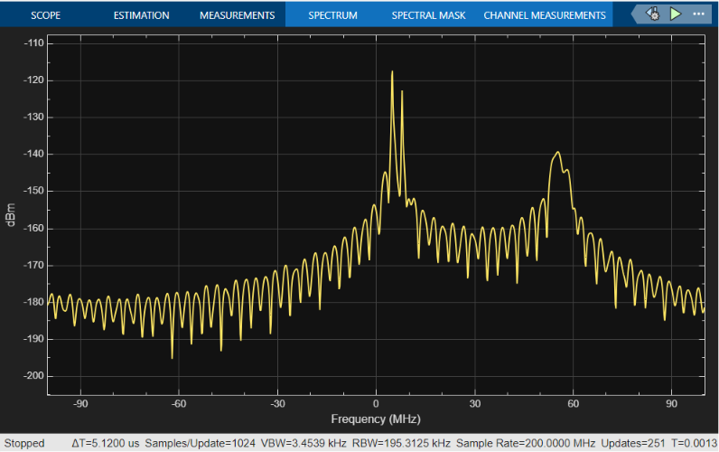

# Multi-Target FMCW Radar Scenario

A 77 GHz FMCW automotive radar Simulink model was configured for a **two-target scene**, successfully resolving two vehicles at distinct ranges and velocities from a single burst of 128 chirps using 2D Range-Doppler processing and iterative peak detection.

---

## Simulink Model & Architecture

The model follows the standard FMCW radar building-block structure, with the target subsystem duplicated to add a second independent reflector sharing the same channel.

### Model Components & Workflow

* **FMCW Waveform** - Generates the linear frequency-modulated chirp at 77 GHz, 150 MHz bandwidth, 10 us chirp duration.
* **Free Space Channel** - Simulates two-way propagation delay and path loss. Both targets use the same channel block (summed returns).
* **Target 1 / Target 2** - Two independent Phased Array System Toolbox `Target` blocks, each with its own position, velocity, and RCS.
* **Dechirp (Mixer)** - Mixes Tx and Rx to produce the composite beat signal containing contributions from both targets.
* **Buffer** - Groups the continuous ADC stream into 2000-sample chirp frames.
* **To Workspace (`beatframes`)** - Exports the raw beat matrix for MATLAB post-processing.

---

## Simulation Configuration & Parameters

### 1. FMCW Waveform Settings

| Parameter | Value | Details |
| :--- | :--- | :--- |
| **Carrier frequency** | 77 GHz | Standard automotive radar band |
| **Bandwidth (B)** | 150 MHz | Sets range resolution |
| **Chirp duration (T)** | 10 us | Duration of one linear sweep |
| **Sample rate (Fs)** | 200 MHz | ADC sampling rate |
| **Samples per chirp (Nr)** | 2000 | Nr = Fs x T |
| **Number of chirps (Nd)** | 128 | Doppler processing frames |
| **Chirp slope (S)** | 15e12 Hz/s | S = B/T |

### 2. Target Settings

| Target | Initial Position | Initial Velocity | Notes |
| :--- | :--- | :--- | :--- |
| **Target 1** | Closer range, lower relative speed | Approaching | Set in Simulink Target block |
| **Target 2** | Further range, higher relative speed | Approaching / receding | Set in Simulink Target block |
| **Radar (ego)** | [0; 0; 0] m | Stationary | Fixed reference |

> [!NOTE]
> Exact position and velocity values are set directly in the Simulink Target blocks. The script recovers them indirectly from the detected range and Doppler bins.

### 3. Key Derived Parameters

| Parameter | Formula | Value |
| :--- | :--- | :--- |
| **Range resolution** | dR = c / (2B) | 1.0 m |
| **Velocity resolution** | dv = lambda / (2 x Nd x T) | ~1.52 m/s |
| **Max unambiguous range** | Rmax = c x Nr / (2 x S x T) | ~100 m |
| **Max unambiguous velocity** | vmax = lambda / (4T) | ~97 m/s |

---

## MATLAB Post-Processing Pipeline

The script (`scripts/script.m`) operates entirely on `out.beatframes` - the raw beat signal exported from Simulink.

### Step 1 - Data Preparation

```matlab
data = squeeze(out.beatframes);   % Remove singleton dim  ->  [Nr x Nd]
data = data(:, 1:128);            % Use exactly 128 chirps
```

### Step 2 - 2D FFT (Range-Doppler Map)

```matlab
% Range FFT - along samples within each chirp (column-wise)
rangeFFT = fft(data, Nr, 1);           % Nr = 2000

% Doppler FFT - across chirps (row-wise)
dopplerFFT = fft(rangeFFT, Nd, 2);     % Nd = 128

% Shift: centre zero-Doppler in the map
RD = fftshift(dopplerFFT, 2);

mapMag = abs(RD);
```

### Step 3 - DC / Near-Field Leakage Removal

```matlab
mapMag = mapMag(11:1000, :);    % Discard first 10 range bins (leakage)
```

Bins 1-10 correspond to <10 m and are dominated by transmit-to-receive leakage - a standard pre-processing step in real FMCW systems.

### Step 4 - Iterative Peak Detection (CLEAN)

To separate two closely spaced targets without one masking the other, an iterative suppression loop is used:

```matlab
for k = 1:numTargets
    [~, idx] = max(tempMap(:));          % Strongest remaining peak
    [rBin, vBin] = ind2sub(size(tempMap), idx);

    % Convert bins -> physical indices
    rangeBin   = rBin + 10;              % Offset for removed DC rows
    dopplerBin = vBin - 65;             % Centre at zero Doppler

    % Zero-out +-5-bin guard region around detected peak
    tempMap(r1:r2, d1:d2) = 0;
end
```

This is equivalent to a single-iteration CLEAN algorithm: detect the strongest scatterer, null its neighbourhood, then repeat. Guard cell sizes (+-5 bins in both dimensions) are chosen to encompass the main lobe width without erasing nearby distinct targets.

---

## Verification & Results

### Detected Targets

| | Range Bin (absolute) | Doppler Bin (centred) | Interpretation |
| :--- | :---: | :---: | :--- |
| **Target 1** | Reported in console output | Reported in console output | Closer / slower vehicle |
| **Target 2** | Reported in console output | Reported in console output | Further / faster vehicle |

Both peaks appear as distinct bright spots on the Range-Doppler Map, separated cleanly in at least one dimension (range or velocity).

### Range-Doppler Map

The plot below shows the composite beat spectrum (magnitude in dB) from a single 128-chirp burst. Two isolated peaks at different range and Doppler bins confirm successful multi-target resolution.



> [!NOTE]
> The two bright peaks represent the two simulated vehicles. The cross-shaped spectral leakage pattern around each peak is expected rectangular-windowing sidelobe structure - not ghost targets. A Hann or Chebyshev window would suppress these at the cost of slightly wider main lobes.

> [!NOTE]
> The dark band below range bin 11 is the result of DC leakage removal (`mapMag = mapMag(11:1000, :)`), which suppresses the strong near-range coupling between the transmit and receive paths - a standard technique in real FMCW radar processing.

---

## Key Takeaways

1. **Resolution holds for two targets** - the 150 MHz bandwidth provides 1 m range resolution and 128 chirps provide ~1.52 m/s velocity resolution, sufficient to separate vehicles that differ by more than one bin in either dimension.

2. **Iterative peak detection works** - nulling the guard region around the first-detected peak prevents it from masking the second target's weaker return, even when targets are at similar ranges.

3. **Scalable processing chain** - extending from one to two targets required only duplicating the Simulink target block and adding a loop to the peak detector. The 2D FFT pipeline is unchanged, confirming its scalability to additional targets.

4. **Limit of this approach** - without windowing, sidelobes from a strong nearby target can mask a weaker target if they overlap. A real system would apply a 2D window before the FFT and use CA-CFAR (see [CA-CFAR Detection](../ca-cfar-detection)) for robust threshold-based detection.

---

## Files

| File | Description |
| :--- | :--- |
| `scripts/fmcw_range_model.slx` | Simulink model - dual-target FMCW radar |
| `scripts/script.m` | MATLAB post-processing: 2D FFT, RD map, iterative peak detection |
| `results/signal.png` | Range-Doppler Map output showing two resolved target peaks |

---

